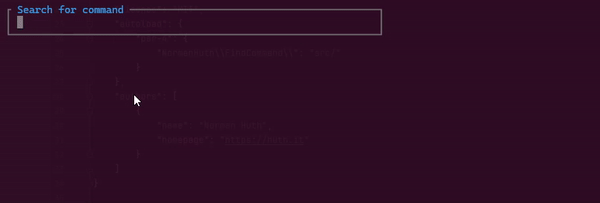

# Find Command

WIP

A 3rd party command for the Frameworks [Symfony](https://symfony.com/) and [Laravel](https://laravel.com).  
This command can be used to search for other commands in a Symfony or Laravel application.  
It uses [Laravel Prompts](https://laravel.com/docs/prompts) under the hoods.



## Dev Status

* Tested with Laravel 11
* No automatic command registration for Laravel (no Service Provider include)
* Execute command not tested

## Install

```shell
composer require norman-huth/find-command
```

### Usage

#### Laravel

Register the `\NormanHuth\FindCommand\LaravelFindCommand` in Your application.

```shell
php artisan find
```

#### Symfony

Register the `\NormanHuth\FindCommand\SymfonyFindCommand` in Your application.

```shell
php bin/console find
```

##### Search in the arguments and options descriptions too

```shell
php artisan find --deep
php bin/console find --deep
```
